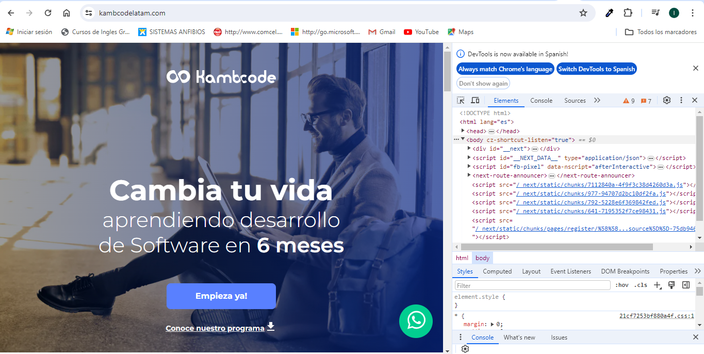
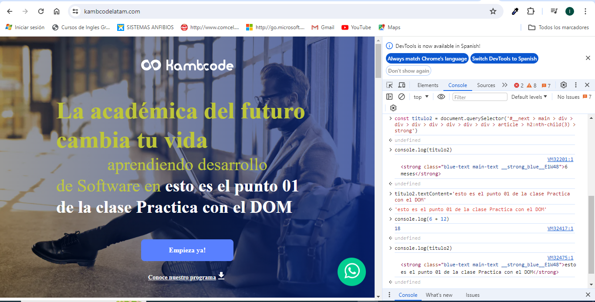
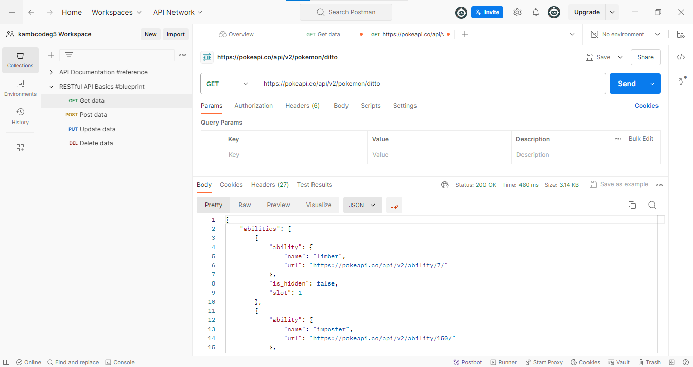
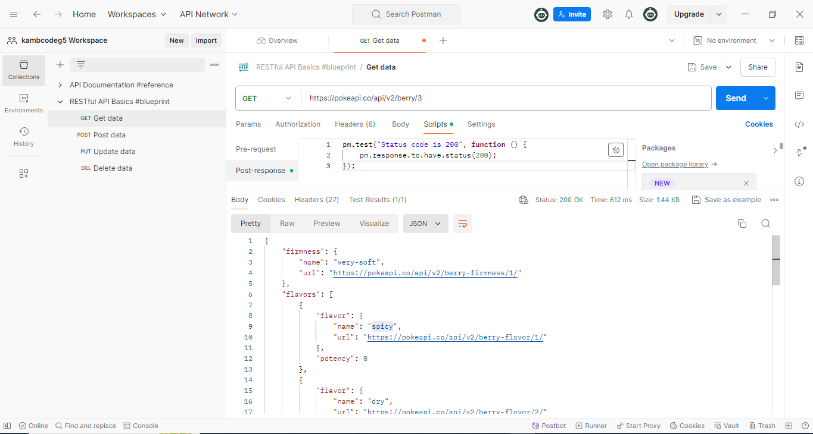
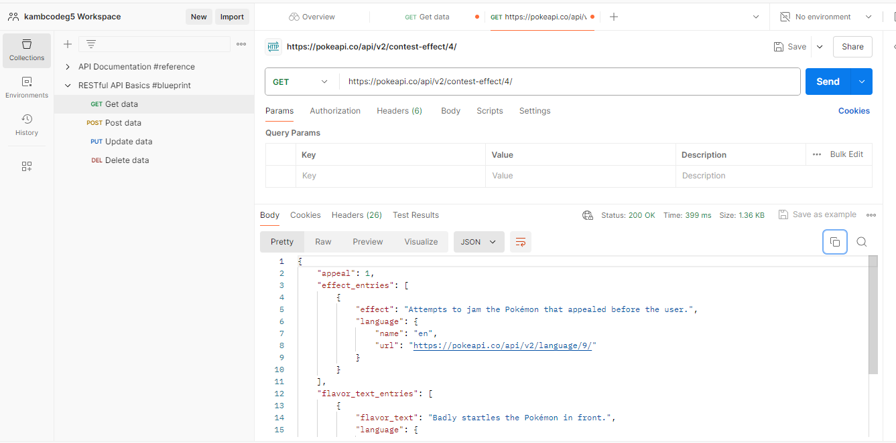

# Tarea para casa: Introducción al DOM y Métodos HTTP.
Crear repositorio en github:
- Nombre: LUIS PALACIOS
- correo: luiscarlos370@hotmail.com y luiscarlos370@gmail.com
- Usuario github: luiscarlos370
- Repositario Tarea 4: 

## Practica con el DOM:
### Modificación del DOM antes.

 
### Modificación del DOM después.

 

## Realizar solicitudes HTTP:

### Solicitud 1 con postman

### Solicitud 2 con postman

### Solicitud 3 con postman

